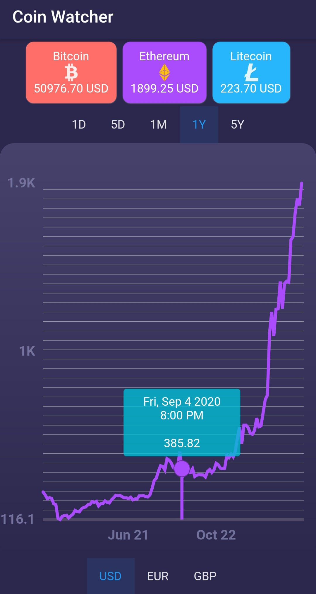
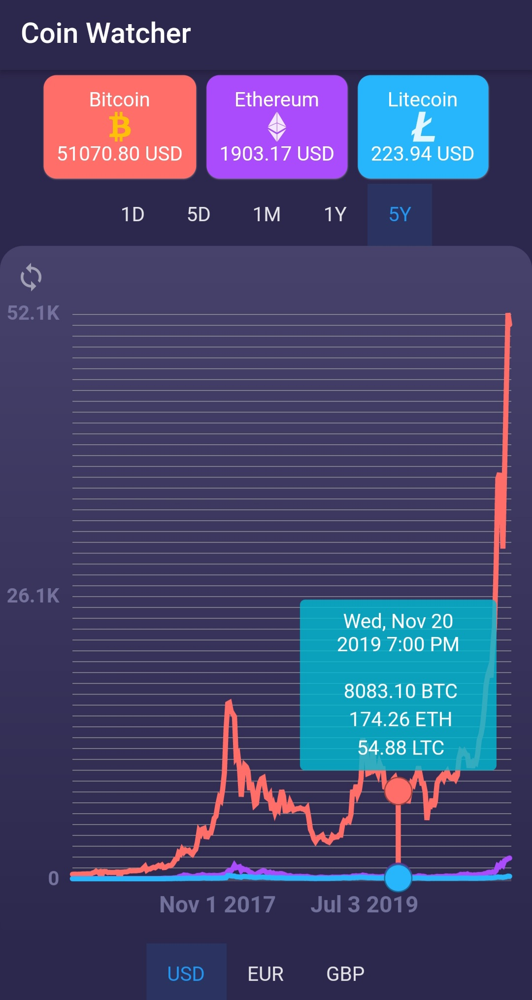

# CoinWatcher

Displays current and historical prices (USD, GBP, EUR) of Bitcoin, Ethereum, and Litecoin with single and triple-data line charts (1D, 5D, 1M, 1Y, 5Y). Developed with Dart, Flutter, Fl_Chart, and Cryptowatch API.

To use this application, you must provide your own API Key. You can register for a free API Key here: https://cryptowat.ch/

This application has been published to the Google Play Store: https://play.google.com/store/apps/details?id=com.londontran.coinwatcher

Developed by London Tran 
https://twitter.com/londontran 
https://www.linkedin.com/in/londontran 

Single Line Chart             |  Triple Line Chart
:-------------------------:|:-------------------------:
  |  

